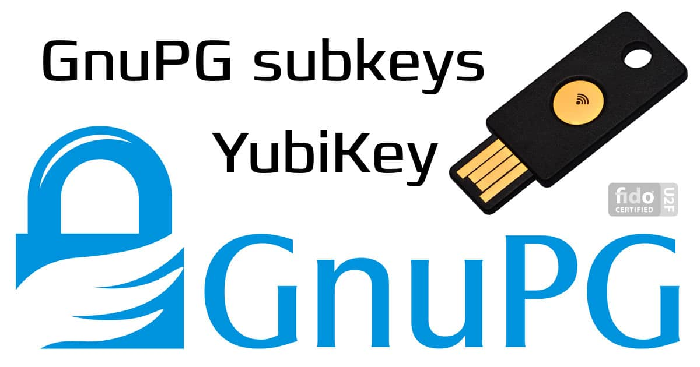

# Yubikey with GPG



## Overview

Yubikey is a hardware component that enhances security through cryptographic functions like key storage and digital signatures. Using OpenPGP/GPG on a Yubikey to digitally sign code commits and emails, or encrypt messages.

## Obtain Public Key from Yubikey

!!! info
    This section is after you've already generated keys, put them on your Yubikey, uploaded your public key to a key server, and placed the URL to that public key on your Yubikey.

1. Plug Yubikey into computer
2. Run ```gpg --card-status``` to ensure your computer sees the Yubikey
3. Run ```gpg --card-edit```
4. Run ```fetch```
5. Type ```quite```
6. Run ```gpg --edit-key $MASTERKEYID```
7. Type ```trust```
8. Follow prompts
9. Type ```quit```

Now confirm the keys are there by using:

To view the public key: ```gpg -k```
To view the secret key: ```gpg -K```

## Generate Keys

1. Run ```gpg --full-generate-key```
2. At the prompt, specify the kind of key you want, or press `enter` to accept the default
3. At the prompt, specify the key size you want, or press `enter` to accept the default
4. Enter the length of time the key should be vaild. Press `enter` to specify the default selection, indicating that the key doesn't expire. Unless you require an expiration date, we recommend accepting this default
5. Verify that your selections are correct
6. Enter your user ID information
7. Type a secure passphrase you'll remember
8. Run ```gpg --list-secret-keys --keyid-format=long``` command to list the long form of the GPG kys for which you have both a public and private key.

## Edit the Keys

### Add a photo

1. Run ```gpg --list-secret-keys --keyid-format=long``` command to list the long form of the GPG kys for which you have both a public and private key.
2. From the list of GPG keys, copy the long form of the GPG key ID you'd like to add a photo to. For the rest of this procedure, the GPG key ID will be refereced with `$MASTERKEYID`.
3. Run ```gpg --expert --edit-key $MASTERKEYID```
4. Type ```addphoto```
5. Follow prompts

## Send Public Key to Ubuntu Keyserver

1. Run ```gpg --keyserver keyserver.ubuntu.com --send-keys $MASTERKEYID```
2. Confirm you get the following feedback: `gpg: sending key $MASTERKEYID to hkp server keyserver.ubuntu.com`

## Add Public Key URL to Yubikey

1. Go to [:octicons-link-external-16: keyserver.ubuntu.com](https://keyserver.ubuntu.com/) and type your `$MASTERKEYID` into the search box
2. You should see `pub` followed by a hyperlink with your `$MASTERKEYID`, right-click that link and copy the URL
3. Run ```gpg --edit-card```
4. Type ```admin```
5. Type ```URL```
6. Paste the url you copied from step 1
7. Enter your Admin PIN

## Move Keys to Yubikey

1. Run ```gpg --edit-key $MASTERKEYID```
2. Select the key you want to move by using `key` followed by a number of the key  
   ```key 2``` (It'll put a `*` next to your selected key)
3. Type `keytocard` to move the selected key to your Yubikey
4. Make the selection based on the key your moving. [E = Encryption Key, S = Signature Key, A = Authentication Key]
5. Repeat steps 2 through 5 until all your keys are on the Yubikey
6. Type `save`
7. Type `quit`

??? abstract "References"
    - [:octicons-link-external-16: GnuPG notes: subkeys, yubikey, gpg1 vs gpg2](https://www.preining.info/blog/2016/04/gnupg-subkeys-yubikey/)