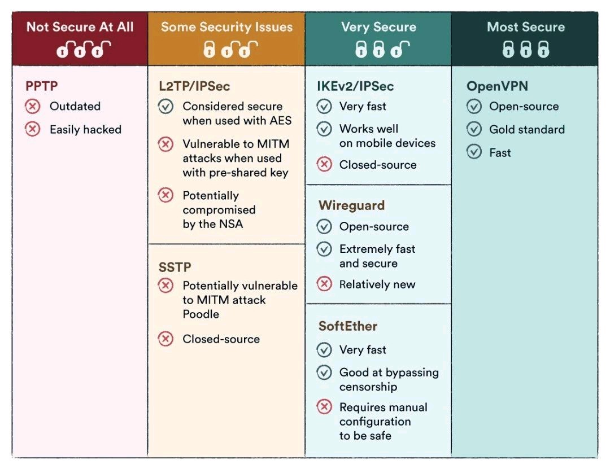

# VPNs

!!! warning
    This section is under construction

!!! danger
    There are a lot of old VPN technologies out there that are *old* and *insecure*. This section will not cover those technologies.
    

!!! tip
    To improve traditional encrypt-then-MAC VPN solutions, one should choose modern AEAD ciphers like `AES-GCM` or `ChaCha20-poly1305`.

## OpenVPN

!!! danger
    More research is required on the OpenVPN TLS protocol. Watching a [:octicons-link-external-16: YouTube video](http://youtu.be/qC3pO61MPeg "IPsec vs. SSL: Security Protocols Comparison") :simple-youtube:  for one of my academic courses stated that TLS does not rekey. Prolong connections can be susceptible to [cryptanalysis]("Cryptanalysis is a process of finding weaknesses in cryptographic algorithms and using these weaknesses to decipher the ciphertext without knowing the secret key (instance deduction). Sometimes the weakness is not in the cryptographic algorithm itself, but rather in how it is applied that makes cryptanalysis successful.")

!!! tip
    While OpenVPN allows either the TCP or UDP protocol to be used as the VPN carrier connection, the UDP protocol will provide better protection against DoS attacks and port scanning than TCP:
    ```bash
        proto udp
    ```

??? cite
    - [:octicons-link-external-16: Hardening OpenVPN Security Guide](https://openvpn.net/community-resources/how-to/#hardening-openvpn-security)

## IPSec

??? cite
    - 

## WireGuard

WireGuard’s protocol was developed from scratch, based
on best cryptographic practices and using the newest ciphers. Contrary to committee-guided protocols like IPsec, WireGuard is strongly opinionated on certain topics and includes radical ideas. It does away with cryptographic agility by locking in on a single AEAD cipher and authentication algorithm with no feature negotiation: `ChaCha20-poly1305`. Backwards compatibility is explicitly missing: handshake and key derivation include a hash of the protocol version number, so two different implementations will derive distinct keys, making them permanently non-compatible. These measures heavily incentivize keeping the software up-to-date and prevent degradation attacks found in SSL.

??? cite
    - Hulsing, A., Ning, K.-C., Schwabe, P., Weber, F., & Zimmermann, P. R. (2021). Post-quantum WireGuard. *2021 IEEE Symposium on Security and Privacy (SP), Security and Privacy (SP), 2021 IEEE Symposium on, SP*, 304–321. [:octicons-link-external-16: https://doi-org.ezproxy.snhu.edu/10.1109/SP40001.2021.00030](https://doi-org.ezproxy.snhu.edu/10.1109/SP40001.2021.00030 "Account/Login Required") :material-file-pdf-box:
    - Lipp, B., Blanchet, B., & Bhargavan, K. (2019). A Mechanised Cryptographic Proof of the WireGuard Virtual Private Network Protocol. *2019 IEEE European Symposium on Security and Privacy (EuroS&P), Security and Privacy (EuroS&P), 2019 IEEE European Symposium On*, 231–246. [:octicons-link-external-16: https://doi-org.ezproxy.snhu.edu/10.1109/EuroSP.2019.00026](https://doi-org.ezproxy.snhu.edu/10.1109/EuroSP.2019.00026 "Account/Login Required") :material-file-pdf-box:
    - Priambodo, D. F., Amiruddin, & Trianto, N. (2021). Hardening a Work from Home Network with Wireguard and Suricata. *2021 International Conference on Computer Science and Engineering (IC2SE), Computer Science and Engineering (IC2SE), 2021 International Conference On*, *1*, 1–4. [:octicons-link-external-16: https://doi-org.ezproxy.snhu.edu/10.1109/IC2SE52832.2021.9791983](https://doi-org.ezproxy.snhu.edu/10.1109/IC2SE52832.2021.9791983 "Account/Login Required") :material-file-pdf-box: