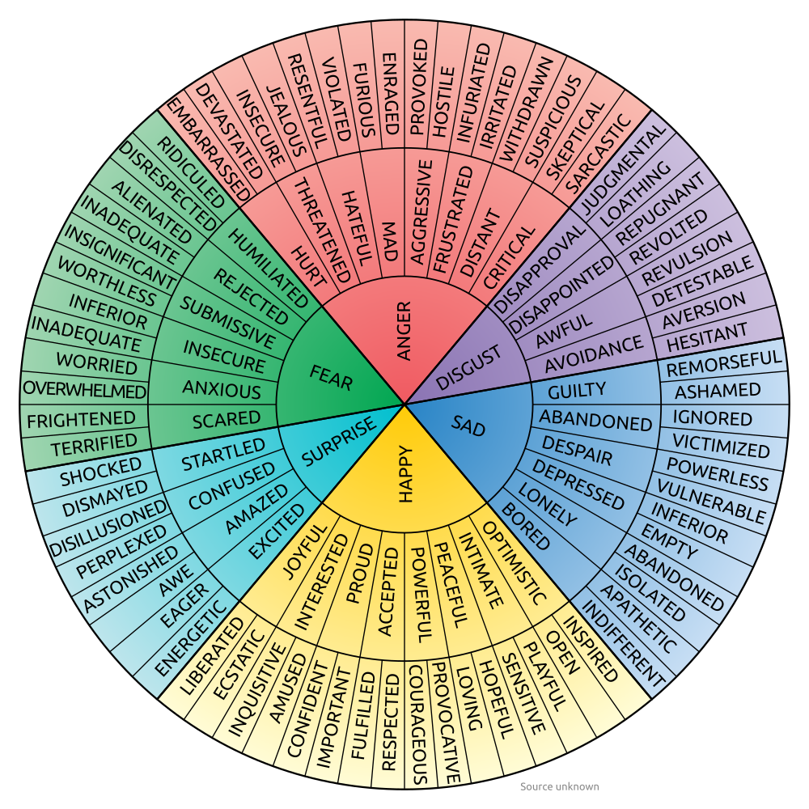

# Mindful Emotion Awareness

## Cognitive Behavioral Therapy

    <figure>
        <figcaption>
            <a href="https://www.claytontherapy.com/cognitive-behavioral-therapy/" target="_blank">Example</a> by <a href="https://www.claytontherapy.com/about-peggy/" target="_blank">Peggy Levinson</a> &copy; 2022 Claytontherapy. All Rights Reserved.
        </figcaption>
    </figure>

## Cognitive Distortions

??? cite
    &copy; 2012 Therapist Aid LLC  
    Provided by [:octicons-link-external-16: TherapistAid.com](https://therapistaid.com)

!!! info "Please excuse the bad UX"

    Card grids wrap each grid item with a beautiful hover card that levitates on hover. However, they are :octicons-beaker-16: experimental and for :octicons-heart-fill-24:{ .heart } [sponsors only](https://squidfunk.github.io/mkdocs-material/insiders/). Once they release to general public, the section below will look beautiful.

    [:octicons-link-external-24: Reference](https://squidfunk.github.io/mkdocs-material/reference/grids/#using-card-grids)

-   __Magnification and Minimization__
    
    ---

    Exaggerating or minimizing the importance of events. One might believe their own achievements are unimportant, or that their mistakes are excessively important.

-   __Catastrophizing__

    ---

    Seeing only the worst possible outcomes of a situation

-   __Overgeneralization__

    ---

    Making broad interpretations from a single or few events. "I felt awkward during my job interview. I am *always* so awkward."

-   __Magical Thinking__

    ---

    The belief that acts will influence unrelated situations. "I am a good person-bad things shouldn't happen to me."

-   __Personalization__

    ---

    The belief that one is responsible for events outside of their own control. "My mom is always upset. She would be fine if I did more to help her."

-   __Jumping to Conclusions__

    ---

    Interpreting the meaning of a situation with little or now evidence.

-   __Mind Reading__

    ---

    Interpreting the thoughts and beliefs of others without adequate evidence. "She would not go on a date with me. She probably thinks I'm ugly."

-   __Fortune Telling__

    ---

    The expectation that a situation will turn out badly without adequate evidence.

-   __Emotional Reasoning__

    ---

    The assumption that emotions relect the way things really are. "I feel like a bad friend, therefore I must be a bad friend."

-   __Disqulifying the Positive__

    ---

    Recognizing only the negative aspects of a situation while ignoring the positive. One might receive many compliments on an evaluation, but focus on the single piece of negative feedback.

-   __"Should" Statements__

    ---

    The belif that things should be a certain way. "I should always be friendly."

-   __All-or-Nothing Thinking__

    ---

    Thinking in absolutes such as "always", "never", or "every". "I *never* do a good enough job on anything."

## Emotions & Feeling Wheel

