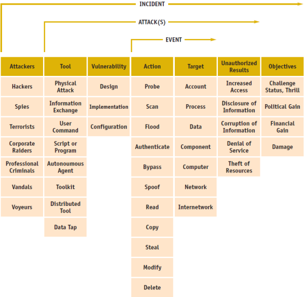

# A Common Language for Computer Security Incidents

!!! abstract "Definition of Terms"
    === "Attackers"

        An individual who attempts one or more attacks in order to achieve an objective – the purpose or end goal of an incident. Based on their objectives, we have divided attackers into the following six categories:

        - **hackers** - attackers who attack computers for challenge, status or the thrill of obtaining access.
        - **spies** - attackers who attack computers for information to be used for political gain.
        - **terrorists** - attackers who attack computers to cause fear for political gain.
        - **corporate raiders** - employees (attackers) who attack competitor’s computers for financial gain.
        - **professional criminals** - attackers who attack computers for personal financial gain.
        - **vandals** - attackers who attack computers to cause damage.
        - **voyeur** – attackers who attack computers for the thrill of obtaining sensitive information.

    === "Tools"

        A means of exploiting a computer or network vulnerability

        - **physical attack** – a means of physically stealing or damaging a computer, network its components, or its supporting systems (such as air conditioning electric power, etc.).
        - **information exchange** - a means of obtaining information either fi-om other attackers (such as through an electronic bulletin board), or from the people being attacked (commonly called social engineering).
        - **user command** - a means of exploiting a vulnerability by entering commands to a process through direct user input at the process interface. An example is entering Unix commands through a telnet connection, or commands at an SMTP port.
        - **script or program** – a means of exploiting a vulnerability by entering commands to a process through the execution of a file of commands (script) or a program at the process intefiace.  
        Examples are a shell script to exploit a software bus a Trojan horse login program, or a password cracking program.
        - **autonomous agent** - a means of exploiting a vulnerability by using a program, or program fragment, which operates independently from the user.  
        Examples are computer viruses or worms.
        - **toolkit** - a software package which contains scripts, programs, or autonomous agents that exploit vulnerabilities.  
        An example is the widely available toolkit called *rootkit*
        - **distributed tool** - a tool that can be distributed to multiple hosts, which can then be coordinated to anonymously perform an attack on the target host simultaneously after some time delay.
        - **data tap** – a means of monitoring the electromagnetic radiation emanating from a computer or network using an external device.

    === "Vulnerability"

        In order to reach the desired result an attacker must take advantage of a computer or network vulnerability, which we define as follows:

        - **Design vulnerability** - a vulnerability inherent in the design or specification of hardware or software whereby even a perfect mplementation will result in a vulnerability.
        - **implementation vulnerability** — a vulnerability resulting from an error made in the software or hardware implementation of a satisfactory design.
        - **Configuration vulnerability** – a vulnerability resulting from an error in the configuration of a system, such as having system accounts with default passwords, having “world write” permission for new files, or having vulnerable services enabled

    === "Action"

        A step taken by a user or process in order to achieve a result, such as to probe, scan, flood, authenticate, bypass, spoof, read, copy, steal, modify, or delete.

        - **probe** – access a target in order to determine its characteristics.
        - **scan** – access a set of tigets sequentially in order to identify which targets have a specific characteristic.
        - **flood** – access a tmget repeatedly in order to overload the target’s capacity.
        - **authenticate** – present an identiiy of someone to a process and, if required, verify that identity, in order to access a target.
        - **bypass** – avoid a process by using an alternative method to access a target.
        - **spoof** – masquerade by assuming the appearance of a different entity in network communications.
        - **read** – obtain the content of datain a storage device, or other data medium.
        - **copy** – reproduce a targetleaving the original target unchanged.
        - **steal** – takepossession of a target without leaving a copy in the original location.
        - **modify**  – change the content or characteristics of a target.
        - **delete** – remove a target or render it irretrievable

    === "Targets"

        - **account** – a domain of user access on a computer or nework which is controlled according to a record of information which contains the user’s account name, password and use restrictions.
        - **process** – a program in execution, consisting of the executable program, the program’s data and stack its program counter, stack pointer and other registers,and all other information needed to execute the program.
        - **data** – representations of facts, concepts, or instructions in a manner suitable for communication, interpretation, or processing by humans or by automatic means. Data can be in the form of *files* in a computer’s volatile or non-volatile memory, or in a data storage device, or in the form of dztuin transitacross a transmission medium.
        - **component–** one of the parts that makeup a computer or network.
        - **computer** – A device that consists of one or more associated components, including processing units and peripheral units, that is controlled by internally stored programs, and that can perform substantial computations, including numerous arithmetic operations, or logic operations, without human intervention during execution. Note May be stand alone, or may consist of several interconnected units.
        - **network** – an interconnected or interrelated group of host computers, switching elements, and interconnecting branches.
        - **internetwork–** a network of networks.

    === "Unauthorized Results"

        - **increased access** — an unauthorized increase in the domain of access on a computer or network.
        - **disclosure of information** - dissemination of information to anyone who is not authorized to access that information.
        - **corruption of information** - unauthorized alteration of data on a computer or network.
        - **denial of service** - intentional degradation or blocking of computer or network resources.

??? cite "Link to Source"
    :octicons-link-external-16: [A Common Language for Computer Security Incidents by John D. Howard & Thomas A. Longstaff](https://doi.org/10.2172/751004) hosted on U.S. Department of Engergy's Office of Scientific and Technical Information.
