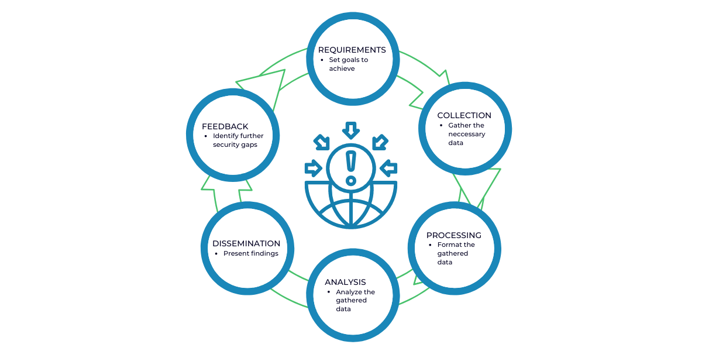

# Cyber Threat Intelligence

## Threat Intelligence Cycle



=== "Planning & Requirements"
    The requirements stage is crucial to the threat intelligence lifecycle because it sets the roadmap for a specific threat intelligence operation. During this planning stage, the team will agree on the goals and methodology of their intelligence program based on the needs of the stakeholders involved.

    * Goals
    * Business-aligned
    * Regulations
    * Most likely threats
        * Who the attackers are and their motivations?
        * What is the attack surface?
        * What specific actions should be taken to strengthen defenses against future attacks?

=== "Collection & Processing"

    Once the requirements are defined, the team then sets out to collect the information required to satisfy those objectives. Depending on the goals, the team will usually seek out traffic logs, publicly available data sources, relevant forums, social media, and industry or subject matter experts. After the raw data has been collected, it will have to be processed into a format suitable for analysis. Most of the time, this entails organizing data points into spreadsheets, decrypting files, translating information from foreign sources, and evaluating the data for relevance and reliability.

    * Organized
    * Consistent
    * Automated (as much as possible)
    * Choose sources of intelligence
    * Processing & nromalizing

=== "Analysis"

    Once the dataset has been processed, the team must then conduct a thorough analysis to find answers to the questions posed in the requirements phase. During the analysis phase, the team also works to decipher the dataset into action items and valuable recommendations for the stakeholders.

    * Turn raw data into actionable information
    * Automation to find the needle in the hay
    * Utilize scripts and SIEM

    ``` mermaid
    graph LR
        A[Events] --> B[Correlation];
        B --> C[Unique Incident];
    ```

=== "Dissemination"

    The dissemination phase requires the threat intelligence team to translate their analysis into a digestible format and present the results to the stakeholders. How the analysis is presented depends on the audience. In most cases the recommendations should be presented concisely, without confusing technical jargon, either in a one-page report or a short slide deck.

    * Internal communication
    * Choose your audience
    * Share with industry partners

    * Types:
        * Strategic Intelligence
        * Operational Intelligence
        * Tactical Intelligence

=== "Feedback"

    The final stage of the threat intelligence lifecycle involves getting feedback on the provided report to determine whether adjustments need to be made for future threat intelligence operations. Stakeholders may have changes to their priorities, the cadence at which they wish to receive intelligence reports, or how data should be disseminated or presented.

    * New findings, new information
    * Lessons learned
    * New threats? Need for change?
    * Update processes

## Intelligence Areas

=== "Strategic"

    Focused on understanding high-level trends and adversarial motives, and then leveraging that understanding to engage in strategic security and business decision-making.  
      
    Stakeholders:

    * CISO
    * CIO
    * CTO
    * Executive Board
    * Strategic Intel

=== "Operational"

    Focused on understanding adversarial capabilities, infrastructure, & TTPs, and then leveraging that understanding to conduct more targeted and prioritized cybersecurity operations.  
      
    Stakeholders:

    * Threat Hunter
    * SOC Analyst
    * Vulnerability Management
    * Incident Response
    * Insider Threat

=== "Tactical"

    Focused on performing malware analysis & enrichment, as well as ingesting atomic, static, and behavioral threat indicators into defensive sybersecurity systems.  
      
    Stakeholders:
    
    * SOC Analyst
    * SIEM
    * Firewall
    * Endpoints
    * IDS/IPS

## Understanding the Environment

:material-brain: **Cyber Security Intelligence**: How secure are we?  
:material-spider: **Cyber Threat Intelligence**: What threats do we face?

### Intelligence Feeds & Tools

[CISA Cybersecurity Alerts & Advisories](https://www.cisa.gov/news-events/cybersecurity-advisories)  
[MISP OSINT Feeds](https://misp-project.org/feeds/)  
[Virustotal](https://www.virustotal.com/gui/home/upload)  
[IBM X-Force Exchange](https://exchange.xforce.ibmcloud.com/)  
[Google Toolbox - Dig](https://toolbox.googleapps.com/apps/dig/)  
[Cisco Talos Intelligence](https://talosintelligence.com/)  
[theHarvester](https://github.com/laramies/theHarvester)  
[censys](https://search.censys.io/search?resource=hosts)  
[Google Hacking Database](https://www.exploit-db.com/google-hacking-database)

### Admiralty Scale

=== "Source Reliability"

    Reliability ratings range from “Reliable” (A) to “Unreliable” (E) as shown in Table B-1. In every instance the rating is based on previous reporting from that source. If there has been no previous reporting, the source must be rated as “F”. [NOTE: An “F” rating does not necessarily mean that the source cannot be trusted, but that there is no reporting history and therefore no basis for making a determination.]

    | Abbr. | Reliability  Rating | Definition |
    |:-----:|:-------------------:|:-----------|
    |A|Reliable|**No doubt** of authenticity, trustworthiness, or competency; has history of complete reliability|
    |B|Usually Reliable|**Minor doubt** about authenticity, trustworthiness, or competency; has a history of valid information most of the time|
    |C|Fairly Reliable|**Doubt** of authenticity, trustworthiness, or competency but has provided valid information in the past|
    |D|Not Usually Reliable|**Significant doubt** about authenticity, trustworthiness, or competency but has provided valid information in the past|
    |E|Unreliable|**Lacking** in authenticity, trustworthiness, and competency; history of invalid information|
    |F|Cannot Be Judged|**No basis** exists for evaluating the reliability of the source|

=== "Information Content"

    The highest degree of confidence in reported information is given to that which has been confirmed by outside sources, “1”. Table B-2 shows evaluation of information content. The degree of confidence decreases if the information is not confirmed, and/or does not seem to make sense. The lowest evaluated rating of “5” means that the information is considered to be false. [NOTE: A rating of “6” does not necessarily mean false information, but is generally used to indicate that no determination can be made since the information is completely new.]

    | Degree | Confidence Rating | Definition |
    |:------:|:-----------------:|:-----------|
    |1|Confirmed|**Confirmed** by other independent sources; **logical** in itself; **consistent** with other information on the subject|
    |2|Probably True|Not confirmed; **logical** in itself; **consistent** with other information on the subject|
    |3|Possibly True|Not confirmed; **reasonably logical** in itself; **agrees with some** other information on the subject|
    |4|Doubtfully Ture|Not confirmed; possible but **not logical**; **no other information** on the subject|
    |5|Improbable|Not confirmed; **not logical** in itself; **contradicted** by other information on the subject|
    |6|Cannot Be Judged|**No basis** exists for evaluating the validity of the information|

## Information Sharing and Analysis Centers (ISACs)

- [Healthcare](https://h-isac.org)
- [Financial](https://fsisac.com)
- [Aviation](https://a-isac.com)
- [Multi-State](https://www.cisecurity.org/ms-isac)
- [Elections Infrastructure](https://www.cisecurity.org/ei-isac)
- [Critical Infrastructure Sectors](https://www.cisa.gov/topics/critical-infrastructure-security-and-resilience/critical-infrastructure-sectors)