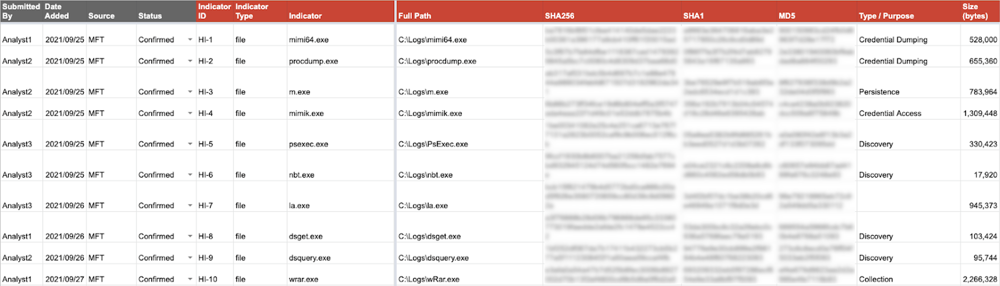
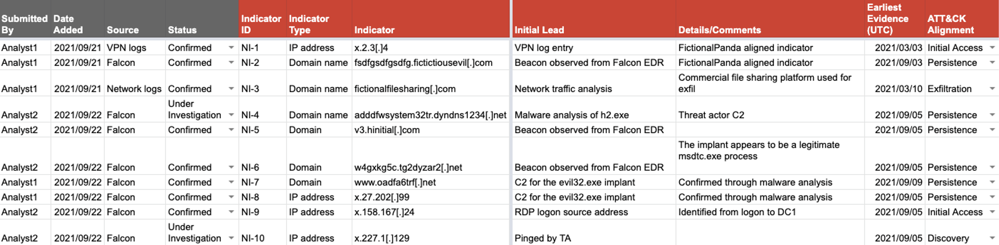
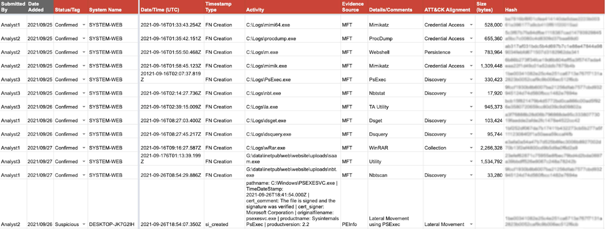

# CrowdStrike Services Offers Incident Response Tracker for the DFIR Community

CrowdStrike Services is releasing a tracker spreadsheet to assist the Digital Forensics and Incident Response (DFIR) community during incident response investigations

- The CrowdStrike Incident Response Tracker is a convenient spreadsheet that includes sections to document indicators of compromise, affected accounts, compromised systems and a timeline of significant events
- CrowdStrike incident response teams have leveraged this type of tracker in thousands of investigations
- [Download the CrowdStrike Incident Response Tracker Template](../static/docs/CrowdStrike-Incident-Response-Tracker-Template.xlsx) :material-microsoft-excel:

During a recent client engagement for a tabletop exercise (TTX), it became apparent that the client did not have a methodology for tracking indicators and building an incident timeline. The CrowdStrike Services team wanted to provide more information to our client on how incidents can and should be tracked, but nothing was available in the public domain that was simple to implement and could be immediately leveraged by responders. To address this gap, we are releasing the CrowdStrike Incident Response Tracker spreadsheet, which is organized into a number of tabs to record various classes of incident-related events in a structured and repeatable manner. 

[:octicons-link-external-16: Digital forensics and incident response (DFIR)](https://www.crowdstrike.com/cybersecurity-101/digital-forensics-and-incident-response-dfir/) teams are typically tasked with performing complex technical investigations that involve receiving and reviewing system images, memory snapshots, logs and other data sources. This results in volumes of evidence tracking, taskings and technical findings across many workstreams. 

Though effective response relies on many elements working harmoniously together, accurately recording and communicating investigative findings is arguably the most critical. One way to do so is to utilize a structured incident response tracker for each investigation that can be used to consolidate and communicate pertinent information in a repeatable fashion. The section below describes how the CrowdStrike Incident Response (IR) Tracker can be utilized and some of the ways it can make managing an incident just a little bit easier.

## CrowdStrike IR Tracker Overview

The benefit of using a tool like the CrowdStrike IR Tracker is that it provides a single place for synthesizing key incident information, including:

- A consolidated incident timeline that forms the basis of the incident narrative
- Incident indicators (e.g., IP addresses, domain names, malware names/hashes, registry entries, etc.)
- Affected account details and systems of interest
- Incident metadata such as key contacts, meeting details, collected evidence items and incident-related requests and tasks

Specifically, the CrowdStrike IR Tracker consists of the following tabs:

- **Investigation Notes**: Area for tracking investigation information such as related incident tickets, conference room and teleconference bridge details, etc. 
- **Contact Info**: External and internal contact information for relevant response personnel
- **Timeline**: Chronological list of attacker activity and related events
- **Systems**: Systems accessed or compromised by the threat actor(s)
- **Accounts**: Accounts exposed or compromised by the threat actor(s)
- **Host Indicators**: File names, directory paths, cryptographic hashes, registry entries, etc., of interest to the investigation (more detail provided below)
- **Network Indicators**: External IP addresses, URLs, domain names, user agent strings, etc., of interest to the investigation (more detail provided below)
- **Request and Task Tracker**: Area for tracking incident-related requests and tasking
- **Evidence Tracker**: Area for tracking evidence collected during the investigation
- **Forensic Keywords**: Incident-specific keywords to facilitate forensic analysis
- **Investigative Queries**: Incident-specific queries for SIEM, log correlation and investigative platforms to facilitate investigative analysis 

An overview of three of our favorite and most heavily leveraged IR Tracker tabs are described below.

## Host Indicators Tab

First, the Host Indicators tab is used to record the suspected and confirmed [:octicons-link-external-16: host indicators of compromise (IOCs)](https://www.crowdstrike.com/cybersecurity-101/indicators-of-compromise/) for the incident. Common examples of host indicators include file names and paths, file hashes, file sizes, service names and registry keys. Having this information readily available for the investigation teams speeds up the analysis and investigation processes. Recording host indicators in a single location gives the team the ability to search for these across additional data sets and pivot to associated indicators from further analysis, and it provides inputs for detection and prevention tools such as a [:octicons-link-external-16: security information and event management (SIEM)](https://www.crowdstrike.com/cybersecurity-101/security-information-and-event-management-siem/) or endpoint detection and response (EDR) platform.

<figure markdown>
  
  <figcaption>Figure 1. Example host indicators</figcaption>
</figure>

The short extract shown above provides the investigation team with the context they need to further their collection and analysis of the incident. Given what we can see above, it is a fair assessment that anything found in the `C:\Logs` path is highly suspicious and should be collected for analysis. Other teams can also search for evidence of these host indicators with their tools using the various keys that have been recorded.

## Network Indicators Tab

Another tab in the CrowdStrike IR Tracker is the Network Indicators tab where the network-related indicators are recorded. An example of just 10 network indicators is shown in Figure 2. Keeping a consolidated list of network indicators simplifies searching additional data sets for the same indicators, helps responders understand what blocks they may want to put in place in the network perimeter, ensures they have an up-to-date list of known network indicators in their SIEM, and pivot to additional threat actor activity from these indicators.

<figure markdown>
  
  <figcaption>Figure 2. Example network indicators</figcaption>
</figure>

## Timeline Tab

The consolidated incident timeline is arguably the biggest benefit of the CrowdStrike IR Tracker. The consolidated incident timeline provides a place for responders to track all relevant incident information, including, but not limited to:

- Suspect account login times and source and destination system(s)
- File creation, modification, deletion and access times 
- Process creation, start and stop times 
- Registry key creation times
- Network connections
- Firewall events
- EDR events

The Timeline tab provides the incident response team with the view of how and when the incident started, how and where the threat actor(s) moved laterally through the organization, and what data may have been impacted. The timeline helps answer the “5Ws and 1H” of the incident: 

- **Who**: can be evident from the tactics, techniques and procedures (TTPs) identified, but not always possible 
- **What**: impacted systems and data 
- **Where**: impacted systems and networks 
- **When**: earliest and most recent evidence of threat actor activity, as well as key events in between
- **Why**: can be evident from the TTPs identified, but not always possible
- **How**: the TTPs of the incident

A fictitious example timeline extract is shown below. There is a lot of information in this very short timeline extract, but we can see that there has been credential access through a number of utilities, webshells, reconnaissance tools and lateral movement. We can also see the times of activity from the threat actor(s) on multiple systems, ranging from Sept. 16, 2021, through Sept. 26, 2021.

<figure markdown>
  
  <figcaption>Figure 3. Example timeline</figcaption>
</figure>

One word of warning — and the constant trap that all investigators deal with every day — is the date formatting in the CrowdStrike IR Tracker. Our **strongest** recommendation is to ensure that all dates are converted to UTC time (00:00) and in ISO 8601 date format. An example of this format is the following date and time: `2021-09-26T18:54:07.350Z`. This same date format and consistency in time zone ensures that when we **sort** the timeline, the data is sorted chronologically. If there is a mess of date formats from different time zones to take into account, we will have a hard time understanding the threat actor’s path through the network. If UTC time zone and ISO 8601 time format are **always** used in the timeline, then life will be a little bit easier. When running a complex investigation, having something that is easier matters, and frankly, when it comes to incidents, being accurate and efficient is paramount.

## Conclusion

With this consolidated and organized information, we can focus on helping the organization identify the impact to business assets, and in conjunction with legal counsel, identify any regulatory reporting requirements. The CrowdStrike IR Tracker also helps ensure that the root cause of the incident gets identified, so your organization can remediate the vulnerabilities that were exploited and led to the incident. 

To make the incident easier to understand for business, we often create attack diagrams or graphical timelines from the consolidated Timeline tab. CrowdStrike often creates these diagrams to succinctly explain incidents for clients that have experienced extensive data breaches of hundreds of systems or over multiple years. 

Finally, it is recommended to use an online collaboration spreadsheet technology such as Office 365 or Google Sheets. Using collaboration tools provides an efficient means for different people to update an online document concurrently and minimizes the risk of versioning issues. Data is also updated in near real time, which helps teams communicate effectively. Some of the repetitive copy and paste tasks can be automated with the scripting features provided by the collaboration technology, but we will leave that for a follow-up blog, and we are happy to hear your ideas on how to minimize the effort on keeping the tracker up to date.

The CrowdStrike IR Tracker itself is not a panacea to cure all ills of the IR process, but rather a tool that, if used correctly, can greatly increase efficiency of collaboration between individuals and teams. Like all tools, it must be used correctly, and one of the key tenets of the CrowdStrike IR teams is our “tracker hygiene.” We know that if the CrowdStrike IR Tracker is not maintained then the results are going to be poor. The tracker gives back, but it can only give back from the effort that is put into it by ALL team members, ALL of the time. Maintaining the tracker for the incident takes work and discipline, but it is our belief that it is very much worth the effort.

CrowdStrike is sharing the [CrowdStrike Incident Response Tracker Template](../static/docs/CrowdStrike-Incident-Response-Tracker-Template.xlsx) :material-microsoft-excel: to give the DFIR community a starting point for collecting and recording incident artifacts in a consolidated and organized fashion. It is our hope that this resource is a useful baseline for building upon within your own organization, or when an IR tracker is needed on short notice.

??? cite "Link to Source"
    [:octicons-link-external-16: CrowdStrike Blog by Paul Pratley Mark Goudie](https://www.crowdstrike.com/blog/crowdstrike-releases-digital-forensics-and-incident-response-tracker/){ .md-button .md-button--primary }