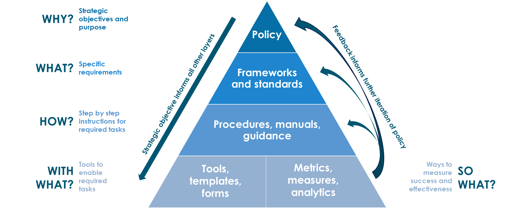
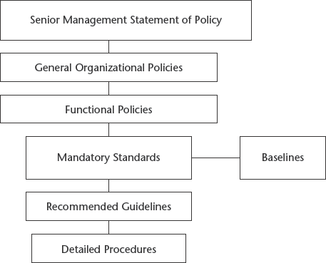

# Policies, Standards, Guidelines, and Procedures

## Policy

*Policy* is one of those terms that can mean several things. For example, there are security policies on firewalls, which refer to the access control and routing list information. Standards, procedures, and guidelines are also referred to as policies in the larger sense of a global information security policy.

A good, well-written policy is more than an exercise created on white paper—it is an essential and fundamental element of sound security practice. A policy, for example, can literally be a lifesaver during a disaster, or it might be a requirement of a governmental or regulatory function. A policy can also provide protection from liability due to an employee's actions, or it can control access to trade secrets.

NIST categorizes computer system security policies into three basic types:

**Program policy**
:   used to create an organization's computer security program

**Issue-specific policies**
:   used to address specific issues of concern to the organization

**System-specific policies**
:   technical directives taken by management to protect a particular system

Program policies and issue-specific policies both address policy from a broad level, usually encompassing the entire organization. Program policy is traditionally more general and strategic; for example, the organization's overall computer security program may be defined in a program policy. An issue-specific policy is a nontechnical policy addressing a single or specific issue of concern to the organization, such as the procedural guidelines for checking disks brought to work or e-mail privacy concerns. Issue-specific policies are similar to program policies in that they are not technically focused.

However, program policy and issue-specific policies do not provide sufficient information or direction, for example, how to establish an access control list or train users on what actions are permitted. System-specific policies fill this need. A system-specific policy is technically focused and addresses only one computer system or device type.

## Standards, Guidelines, and Procedures

The next level down from policies consists of the three elements of policy implementation: standards, guidelines, and procedures. These three elements contain the actual details of the policy, such as how it should be implemented and what standards and procedures should be used. They are published throughout the organization via manuals, the intranet, handbooks, or awareness classes.

It is important to know that standards, guidelines, and procedures are separate yet linked documents from the general policies (especially the senior-level statement).

**Standards**
:   Standards specify the use of specific technologies in a uniform way. This standardization of operating procedures can be a benefit to an organization by specifying the uniform methodologies to be used for the security controls. Standards are usually compulsory and are implemented throughout an organization for uniformity.

**Guidelines**
:   Guidelines are similar to standards; they refer to the methodologies of securing systems, but they are only recommended actions and are not compulsory. Guidelines are more flexible than standards and take into consideration the varying nature of the information systems. Guidelines can be used to specify the way standards should be developed, for example, or to guarantee the adherence to general security principles.

**Procedures**
:   Procedures embody the detailed steps that are followed to perform a specific task. Procedures are the detailed actions that personnel must follow. They are considered the lowest level in the policy chain. Their purpose is to provide detailed steps for implementing the policies, standards, and guidelines previously created. Practices is also a term that is frequently used in reference to procedures.

## Baselines

Once a consistent set of baselines has been created, it is possible to design the security architecture of an organization and develop standards. Baselines take into consideration the difference between various operating systems, for example, to ensure that the security is being uniformly implemented throughout the enterprise.

??? cite "Link to Source"
    [:fontawesome-solid-external-link-alt: The CISSP&reg; and CAP Prep Guide: Platinum Edition by Ronald L. Krutz & Russell Dean Vines](https://learning.oreilly.com/library/view/the-cissp-r-and/9780470007921/){ .md-button .md-button--primary }