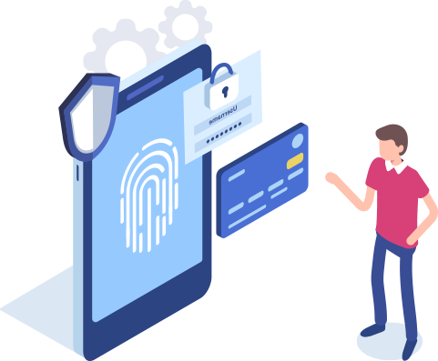

# 10 Things Auditors Should Know
### For more information, go to [isaca.org](https://www.isaca.org/resources/news-and-trends/isaca-now-blog/2016/suggested-tips-auditors-need-to-know-about-cyber-security).

Auditors have an obligation to educate themselves on this powerful and evolving technology, and there is much to learn. Below are 10 things an auditor needs to know about cyber security. This list is not all-encompassing, nor is it ranked in any order.

1.    **Everything is connected to everything**. The primary function and objective of any cyber device is connectivity. Devices are like climbers roped together on the side of a mountain – if one falls, it can bring down anything connected to it. The Target hack (through an HVAC supplier connection) clearly demonstrates the need for a holistic cyber security view. With the arrival of the Internet of Things, it’s imperative that auditors understand and address the bigger picture.
2.    **All risks are subjective**. To qualify as a “risk,” a threat needs to be associated with a vulnerability that – if exploited – could negatively impact an information asset. If it does not, it is not a threat. Too many auditors worry about threats and vulnerabilities that pose no actual risk to an asset, prioritizing compliance over risk and wasting precious time and resources.
3.    **Users are (and will always be) the biggest security risk.** Our industry is led by vendors, and we continue to seek security through products (firewalls, IDS/IPS, DLP, etc.). We invest in product before people while real and measurable results can be achieved by investing in information security awareness. To contribute tangible results, auditors should prioritize people over product. Cyber security education is the silver bullet.
 4.   **Leverage existing frameworks/guidelines.** Auditors should consider mapping of the NIST “Framework for Improving Critical Infrastructure Cybersecurity” to ISO 27001:2013 controls and COBIT 5 to reduce the scope of the audit, making the audit more manageable.
5.    **Consider forthcoming legislation.** Auditors should study how forthcoming and existing legislation like General Data Protection Regulation (GDPR) and Payment Card Industry Data Security Standard (PCI-DSS) could potentially be incorporated into cyber security programs. Also, auditors need to understand the global regulatory environment and the differences that can exist between different geographic regions.
6.   ** Basic information security controls still hold true.** As part of overall security (including cyber security), these controls provide a valid baseline of security controls that help create in-depth security, such as physical and logical access controls and application of “principle of least privilege.”
7.    **Utilize a cyber incident response policy and plan that is fully tested.** Auditors need to assess whether a proper crisis management and communication plan is in place, clearly communicated and tested as appropriate. This should enable sufficient business continuity in the event of a cyber security breach. Crisis management should include incident response and forensics, where warranted. Proactive monitoring and detection (with automated tools) should be in place.
8.   **Cyber security strategy needs to be agile – the landscape is “mutating.”** Strategy needs to be adaptable and scalable to handle new attack methods, such as ransomware and cloud-related risks. Auditors need to be aware that this is an area that is constantly changing and must not assume that what currently keeps your IT environment secure will continue to remain secure indefinitely.
9.    **Cyber security awareness depends on the right training**. Employees need sufficient and timely education and training to help combat ever-changing cyber security threat. Security needs to be interwoven into the fabric on an organization.  One-off, box-checking exercises are not sufficient. For example:
      - Do employees understand the implications of a cyber security breach?
      -    Has any thought been given to insider threats from a cyber security perspective?
      -    Is there clear guidance on the use of social media/shadow IT solutions/BYOD/how to respond to a phishing or ransomware attack?
      -    Are employees rewarded/praised for promoting security in an organization? Are they incentivized?
10.    **Be aware of credential theft techniques**. Auditors should have knowledge of credential theft attack techniques. Typically, the Pass-the-Hash (PtH) attack and other credential theft attacks utilize an iterative, two-stage process. First, an attacker captures account logon credentials on one computer, and then uses those captured credentials to authenticate to other computers over the network.
