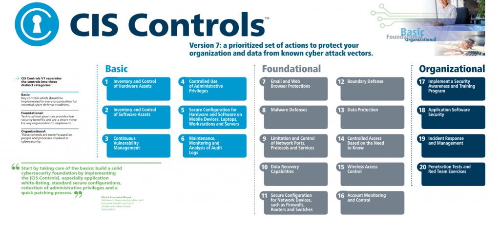

# CIS Controls

!!! fail "Outdated material"
    The information and links listed below are for the older version 7. Visit [https://www.cisecurity.org/controls/](https://www.cisecurity.org/controls/) for the latest version.

??? cite "Link to CIS Workbench"
    [:fontawesome-solid-external-link-alt: Workbench Login](https://workbench.cisecurity.org/files/2312/download/2608){ .md-button .md-button--primary }